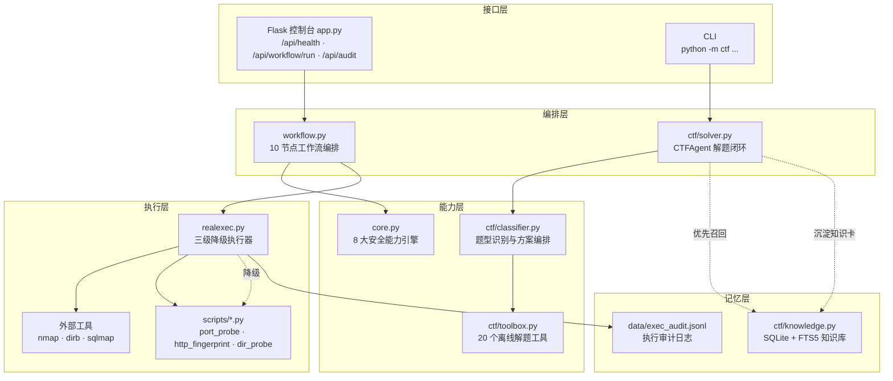

# MyAgentForSecurityCheckingAndFixing

[](https://github.com/Ixnery-Karity/MyAgentForSecurityCheckingAndFixing/actions/workflows/ci.yml)


一个面向授权内网靶场的安全检查工作流控制台，并附带一个**会自己解题、也会自己记笔记**的 CTF Agent。

项目把原目录中的 8 个实验脚本统一成一个可运行的、离线优先的 agent：

范围校验 → 规划 → 侦察模拟 → 代码审计 → JVM 内存排查 → PatchDiff → 二进制分析 → SOP 检索 → 提示词注入防护 → 报告

---

## 🆕 两大新增能力

### 1. CTF 解题 Agent（`ctf/`）—— 带本地知识库与自主学习

```powershell
python -m ctf demo                      # 跑 10 道内置题，演示学习闭环
python -m ctf solve --text "ZmxhZ3tiYXNlNjR9"
python -m ctf kb search base64          # 检索已积累的知识卡
python -m ctf kb stats
```

- **离线优先**：20 个纯 Python 工具（编码 / 古典密码 / 哈希 / 异或 / 文件识别），无网络、无模型也能解题。
- **自动套娃解码**：广度优先组合编码工具，支持双重 Base64、`base64 → hex → 明文` 这类嵌套。
- **本地知识库**：SQLite + FTS5 全文检索，知识卡按指纹幂等写入，置信度随实战成败自动升降。
- **自主学习闭环**：每次解题（无论成败）都提炼知识卡入库；**下次同题型优先召回高分经验并排到方案队首**。
- **可信度把关**：区分真实 flag 与编码误报（如 ROT13 产出的乱码），低可信结果标记为需人工复核。

> `python -m ctf demo` 的**第二轮**会展示「知识库命中」——这就是自主学习生效的直接证据。

### 2. 真实执行层（`realexec.py`）—— 让"模拟能力"真正跑起来

原先只做模拟的侦察节点，现在支持接入**真实命令与你自己的脚本**，采用三级降级：

| 层级 | 触发条件 | 说明 |
|---|---|---|
| 🟢 **真实外部工具** | 系统装了 nmap / dirb / sqlmap 且已授权 | 走参数数组调用，**不使用 shell** |
| 🔵 **内置脚本兜底** | 未装外部工具 | 改用 `scripts/` 下自研纯 Python 脚本，真连真扫 |
| ⚪ **确定性模拟** | 未启用 / 未授权 / 非白名单目标 | 保证任何环境都能跑通完整流程 |

```powershell
# 默认：不执行任何命令，只返回模拟结果
python realexec.py --tool nmap --target 127.0.0.1

# 真实执行（需显式授权 + 目标在白名单内）
python realexec.py --tool nmap --target 127.0.0.1 --real --authorized
python realexec.py --tool http_fingerprint --url http://127.0.0.1:5000 --real --authorized

# 只看会执行什么命令，不真的跑
python realexec.py --tool nmap --target 127.0.0.1 --real --authorized --dry-run
```

内置脚本（`scripts/`，零第三方依赖）：

- `port_probe.py`：纯 Python TCP 连接探测（nmap 的最小替代实现）
- `http_fingerprint.py`：真实发起请求，抓取响应头、页面标题、技术栈与缺失的安全响应头
- `dir_probe.py`：低风险路径探测（非字典爆破）

工作流集成：`POST /api/workflow/run` 传入 `{"real_exec": true, "authorized": true}`，侦察节点即走真实执行。

---

## 安全边界

- **默认不调用模型、不发起网络扫描、不执行系统命令**；真实执行需「显式开关 + 授权标记 + 白名单目标」三重条件。
- 目标必须落在私网 / 回环网段（`127.0.0.0/8`、`10/8`、`172.16/12`、`192.168/16`），**公网目标与域名一律拒绝**。
- 强制超时、输出截断、速率限制；**只走参数数组，不使用 `shell=True`**，从根上杜绝命令拼接注入。
- **全量审计日志**（JSONL，含成功路径）写入 `data/exec_audit.jsonl`。
- 外部日志被视为不可信输入；检测到提示词注入后工作流会标记为 blocked。
- 模型输出永远不会直接进入 shell。
- 全部能力仅限**你拥有明确授权的系统**使用（详见 [LICENSE](LICENSE) 中的合规声明）。

## 架构



**三级降级**是执行层的核心：装了真实工具就用真实工具，没装就用自研脚本，都不满足才退回确定性模拟 ——
任何环境都能跑通，且**默认不做任何有副作用的事**。

## 快速启动

三步看到完整效果：

~~~powershell
git clone https://github.com/Ixnery-Karity/SentinelFlow-Console.git
cd SentinelFlow-Console
pip install -r requirements.txt -r requirements-dev.txt

python -m pytest tests/ -q      # ① 67 项测试全绿
python -m ctf demo              # ② 看 CTF Agent 解题 + 自主学习闭环
python app.py                   # ③ 打开 http://127.0.0.1:5000 看控制台
~~~

打开控制台后页面提供默认样例，点击"开始安全检查"即可看到完整工作流、风险指标和审计事件。

## 测试

~~~powershell
python -m pytest tests/ -q      # 全量 67 项（CTF 36 + 真实执行层 31）
python -m ctf selftest          # CTF 工具箱自检
python -m ctf tools             # 列出全部 20 个离线工具
~~~

CI 已配置三版本 Python 矩阵（3.11 / 3.12 / 3.13），并包含**安全边界断言**：
默认必须是 `simulated`、公网目标必须被 `blocked` —— 谁改坏了边界，CI 会直接挂。

## API

- GET /api/health：健康检查
- POST /api/workflow/run：运行端到端工作流，JSON 字段可传 target、objective、code、diff、logs、pseudocode、question、real_exec、authorized、dry_run
- POST /api/audit：只运行代码审计

## 8 个兼容入口

原始文件名保留，均可直接运行并输出 JSON。它们现在共享 core.py，不会重复初始化客户端或依赖本地向量模型：

~~~powershell
python "1-代码审计和修复引擎.py"
python "2-PAE.py"
python "3-sop.py"
python "4-MCP工具查杀引擎.py"
python "5-自动化patchdiff漏洞分析引擎引擎.py"
python "6-PAE自动渗透.py"
python "7-AI赋能进行二进制分析插件.py"
python "8-间接提示词注入导致服务器RCE漏洞.py"
~~~

## 目录

- `core.py`：安全的离线分析器和工具适配器
- `workflow.py`：上下游编排与统一报告
- `app.py`：Flask API 与静态页面入口
- `realexec.py`：真实执行层（三级降级 + 安全边界 + 审计日志）
- `ctf/`：CTF 解题 Agent（工具箱 / 题型识别 / 知识库 / 求解器 / CLI）
- `scripts/`：可被 Agent 调用的真实脚本（端口探测 / HTTP 指纹 / 路径探测）
- `static/`：响应式运维控制台
- `design-system/security-workflow-console/MASTER.md`：按 UI/UX Pro Max 生成的设计系统
- `tests/`：核心、API、兼容入口、CTF、真实执行层测试
- `CHANGELOG.md`：版本变更记录（语义化版本）
- `LICENSE`：MIT + 安全合规声明

## 版本

当前版本 **v1.1.1**（见 [CHANGELOG.md](CHANGELOG.md)）。遵循语义化版本规范：每次发布打 tag 并在 GitHub Releases 记录变更。
